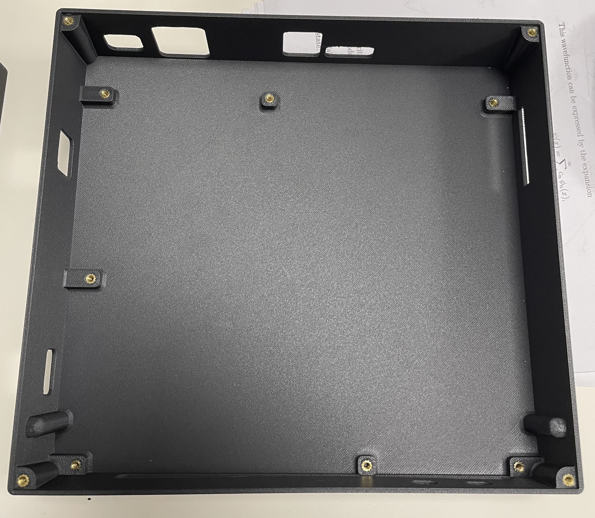
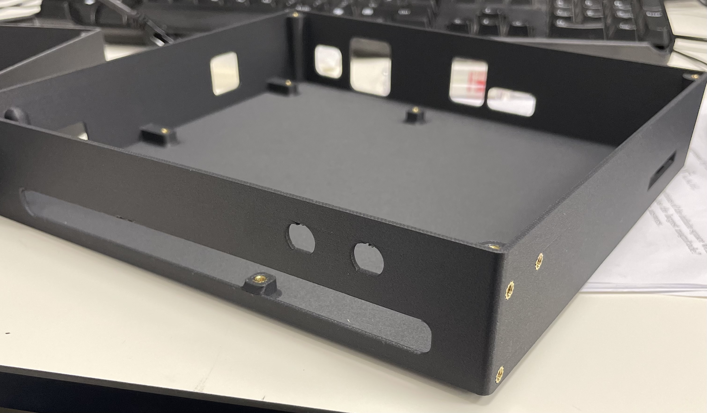
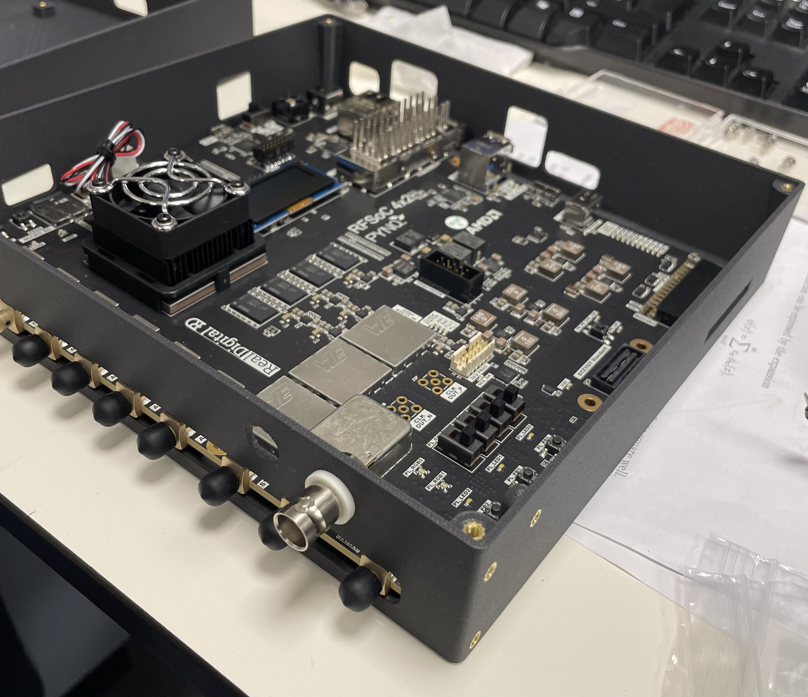
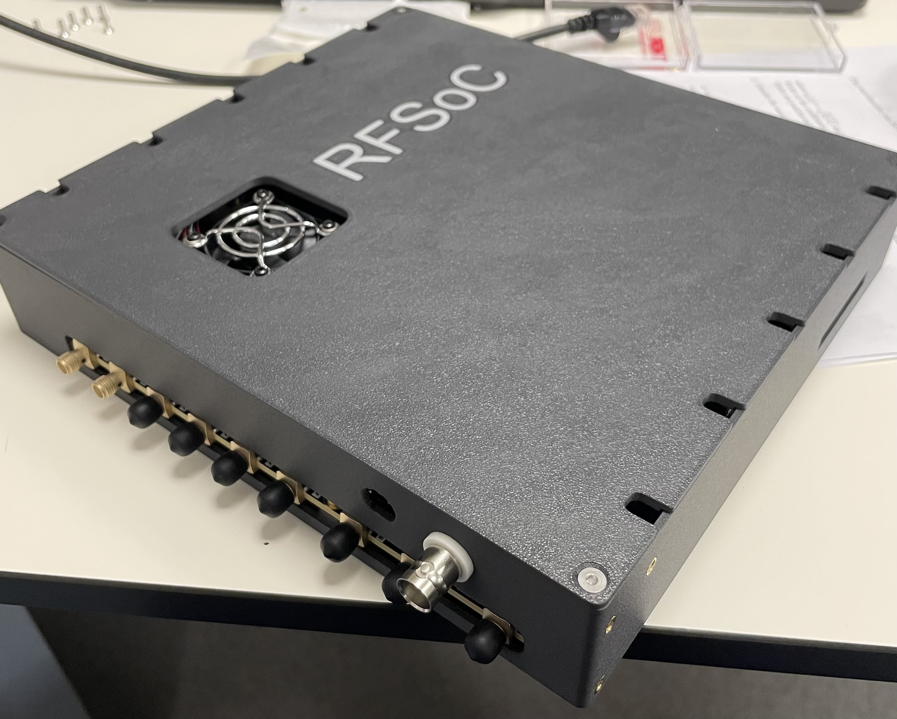

# RFSoC4x2-3D-print-box
A parametetrically designed box for the RFSoC 4x2, made with Autodesk Fusion.
Has M3 heatset inserts for board mounting, and lid fastening. This box only exposes the connectors we need, so please modify as necessary.

We print our boxes with PETG-CF on a Bambu Lab H2S. PLA is not recommended due to the heat the RFSoC board produces.

7 (board) + 4 (lid) + 6 (optional box mount) = 17 heat set M3 inserts per box.
Lid needs M3 countersunk screws.
We use M3 socket cap screws for the board.

Designed for heat set M3 inserts with 4.1mm hole diameter, and 5.8mm length.

Extra holes on front panel are for insulated 50 ohm BNC Panel Mount Socket - Solder Termination.

 Copyright (C) 2025 Tom Hepworth
